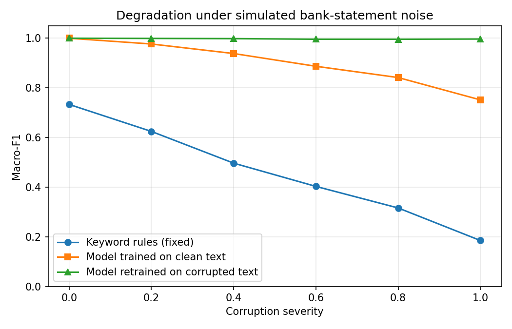

# Transaction categorisation

Categorising bank transaction descriptions into 9 spending categories. Keyword baseline vs a char n-gram classifier — then I broke the data to see which held up.

This is an evening's work, not a production system.

## The problem

[Kaggle dataset](https://www.kaggle.com/datasets/bhavyasingh25/financial-transaction-description-dataset), 5,000 rows. `drop_duplicates()` removes nothing, but that's misleading — the amounts and reference codes are randomised. Strip those and there are **45 distinct sentences**, each repeated ~111 times.

So train and test contain the same strings. The classifier scored **macro-F1 1.000**, which tells you nothing.

## Making it harder

I degraded the text toward what real statements look like — dropped vowels, `POS`/`ACH` prefixes, lost spaces, truncation to a fixed width. All things payment processors actually do.

```
'Medical test charges INR 42905 TXN67a07fa2'
  0.5   'CRD MEDICAL TES CHARGS INR 429'
  1.0   'XX MDCL TST CHRGS IR'
```

| Severity | Rules | Model (clean-trained) | Model (retrained) |
|---:|---:|---:|---:|
| 0.0 | 0.733 | 1.000 | 1.000 |
| 0.4 | 0.497 | 0.938 | 0.998 |
| 0.6 | 0.403 | 0.887 | 0.996 |
| 1.0 | 0.185 | 0.752 | 0.997 |



The flat line isn't as impressive as it looks — with 45 templates the retrained model sees ~83 corrupted versions of each. It's recognising known patterns through noise, not generalising to unseen merchants.

## What I found

**Rules fail silently.** Precision was 1.00 on every class — when a rule fires it's right. But coverage was only 0.688, so 387 test rows matched nothing and got dumped into the majority class. Nothing in the output distinguishes a real match from a fallback guess.

**The model's errors are readable.** Biggest confusion was entertainment → travel, 32 cases, all `Movie ticket booking`:

```
[0.70] entertainment -> travel | OS M TCKT BOOKING INR 4563 T
```

Once "MOVIE" is mangled, *ticket booking* is a travel phrase. I'd have got these wrong too.

**And it knows when it's guessing.** Low-confidence errors sit at 0.15–0.16 against a chance level of 0.111. Both systems get these wrong, but you can filter a confidence score — you can't filter a silent fallback. For a lending decision that matters more than a few points of F1.

**Rules never beat the model.** Three rows looked like wins. All three were the majority-class fallback getting lucky — no keyword fired at all. I nearly wrote it up the other way.

## Next

- Merchant normalisation before classification — [this paper](https://arxiv.org/abs/2508.05425) suggests that's where the gains are
- Amount and sign as features
- Route the 0.15-confidence band to human review
- Real data, with merchants the model hasn't seen

## Open questions

Where do the category boundaries actually go? Hospital pharmacy — healthcare or shopping? And is entertainment → travel even an error for a lender looking at discretionary spend? If not, 32 of my 141 errors aren't errors. These are policy calls, not data problems.

## Run it

```bash
pip install -r requirements.txt
# put train_transactions.csv in data/
jupyter notebook notebook.ipynb
```

Split from `train_transactions.csv`, `random_state=42`. `data/` is gitignored.
